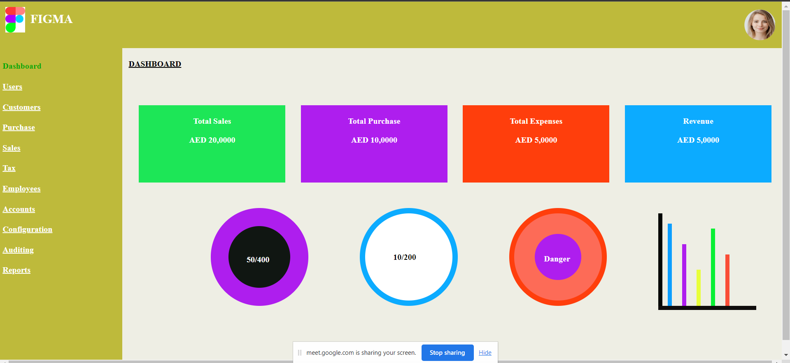

# Betasqurial-tasks

Assignments

## tasks

| Requirements                             | Outputs                         |
| ---------------------------------------- | ------------------------------- |
|  |  |
|  |  |
|  |  |

## reading-tasks

- [Home](https://www.w3schools.com/html/default.asp)
- [Introduction](https://www.w3schools.com/html/html_intro.asp)
- [Editor](https://www.w3schools.com/html/html_editors.asp)
- [Basics](https://www.w3schools.com/html/html_basic.asp)
- [Elements](https://www.w3schools.com/html/html_elements.asp)
- [Attributes](https://www.w3schools.com/html/html_attributes.asp)
- [Headings](https://www.w3schools.com/html/html_headings.asp)
- [Paragraphs](https://www.w3schools.com/html/html_paragraphs.asp)
- [Styles](https://www.w3schools.com/html/html_styles.asp)
- [Formatting](https://www.w3schools.com/html/html_formatting.asp)
- [Quotation](https://www.w3schools.com/html/html_quotation_elements.asp)
- [comments](https://www.w3schools.com/html/html_comments.asp)
- [color](https://www.w3schools.com/html/html_colors.asp)
- [CSS](https://www.w3schools.com/html/html_css.asp)
- [Links](https://www.w3schools.com/html/html_links.asp)
- [Images](https://www.w3schools.com/html/html_images.asp)
- [Classes](https://www.w3schools.com/html/html_classes.asp)
- [Id](https://www.w3schools.com/html/html_id.asp)

## website-link

[My-tasks](https://alanjamesjacob.github.io/betasqurial-/)

## git-commands

1. git config Config git user. EX: git config --global user.name "alan-james",git config user.email "jamespaadikkal@gmail.com"
2. git clone clone a remote git repositery to your local. Ex: git clone "add user https lijnk or ssh key"
3. git add Add your file changes to git.Ex:git add . :this will add all file to the repo git add README.md this will add the readme file we can specify using the file name
4. git commit commit changes to git
5. git push push your local commits to repo

## linux-commands

- cd - change current directory
- ls - list contents of a directory
- pwd- dispaly current working directory path
- cat- Display contents of a file
